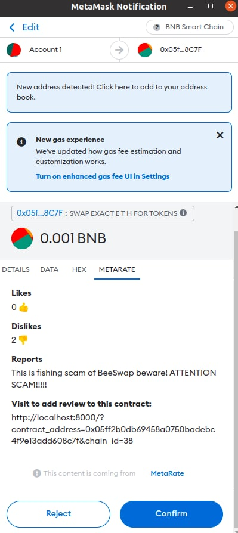

# Reporter snap from MetaRate

This repo contains the PoC of the Decentralised reviews of Smart contracts, using Metamask snap's transaction insights.



## Description

Every time user is about to execute a transaction, he will see the reviews and likes for the Smart Contract he interacts with. Those reviews are done by other verified users (Proof of humanity from [Cheshire](https://cheshire.wtf/) API). All the reviews and likes are stored in the decentralised data storage [Swarm](https://www.ethswarm.org/).

[_ethBrno hackaton third place from quadratic voting_](https://devfolio.co/projects/metarate-7c20)
## Start the project locally

```shell
yarn install && yarn start
```

## Notes

Hackaton version could be run, only using local node of Swarm for persisting user reviews.

SBT verification was disabled, because `cheshire.wtf` API was down from our count of requests:) Now it should be ok.

## Future Development

- Release snap to the npm registry
- Enable Proof of Humanity by `cheshire.wtf`
- Connect to the public deployed swarm nodes
- Move review form to Metamask Snaps when Custom UI in MetaMask Snaps will be released
- Use SubtleCrypto to verify user's signed reviews in snap, or add the Graphql layer for quering and parsing data from Swarm storage.


